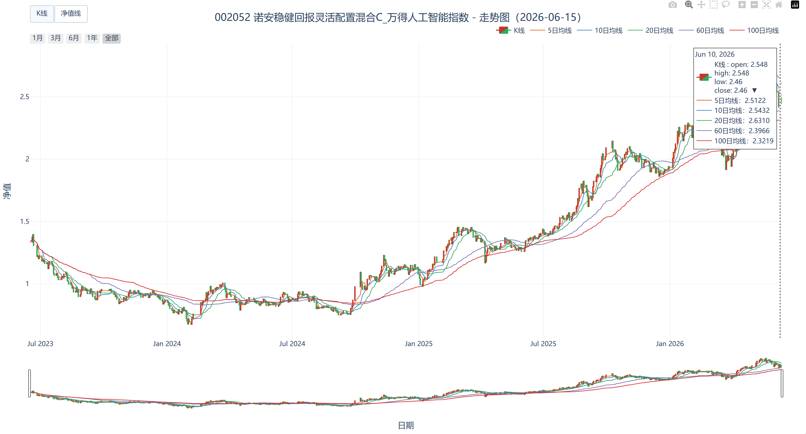

# fund-nav-tracker · 基金净值均线可视化与每日追踪工具

**语言 / Language：** [中文](#中文) ｜ [English](#english)

> 自动抓取关注列表里的基金净值，计算多周期均线，生成可交互的 K 线 / 净值走势图，并支持每日定时增量更新与总览看板。
>
> Automatically fetch NAVs for a watchlist of funds, compute multi-period moving averages, generate interactive candlestick / NAV charts, and update daily with an overview dashboard.

---

<a name="中文"></a>
## 中文

一个面向个人基金观察的轻量工具：把"每天手动查净值、算均线、看走势"这件重复的事，变成一条命令（或一个定时任务）跑完，结果按日期归档、浏览器直接看。

### ✨ 功能特性

- **多数据源自动降级**：`akshare → 东方财富 → 模拟数据` 依次尝试，任一失败自动切换，保证永远能跑通。
- **多周期均线**：内置 5 / 10 / 20 / 60 / 100 日均线，周期可配置。
- **交互式可视化（Plotly）**：缩放、拖拽、框选、区间快捷按钮、底部 range slider；点击图例可单独显示/隐藏任意一条线；悬停显示基金名称、编号、当日净值与各均线值。
- **K 线 / 净值线一键切换**：同一张图内按钮切换，K 线按国内习惯红涨绿跌。
- **每日增量更新**：净值缓存到本地 CSV，每天只补抓新增交易日，不重爬历史；输出按 `YYYY-MM-DD` 日期目录归档。
- **总览看板**：一张 `index.html` 列出全部基金的最新净值与当日涨跌，点名称跳转对应走势图。
- **跨平台中文**：依赖浏览器字体栈渲染，Windows / macOS / Linux 均无乱码。
- **为 Web 预留接口**：数据层 / 计算层 / 可视化层分离，核心方法返回 `pandas.DataFrame`，Plotly `fig` 可直接嵌入 Flask / FastAPI。

### 📸 预览




### 🔧 环境与安装

需要 Python ≥ 3.9。

```bash
git clone https://github.com/<你的用户名>/fund-nav-tracker.git
cd fund-nav-tracker
pip install -r requirements.txt
```

国内安装建议加清华镜像：`pip install -r requirements.txt -i https://pypi.tuna.tsinghua.edu.cn/simple`

### 🚀 快速开始

**单只基金（交互式）**：运行后按提示输入 6 位基金代码，生成对应走势图。

```bash
python fund_analyzer.py
```

**批量更新关注列表（一次跑完所有基金 + 总览页）**：

```bash
python daily_fund_agent.py
```

跑完打开当天日期目录下的 `index.html` 查看总览。关注哪些基金、代码与中文名的映射，统一维护在 `fund_analyzer.py` 顶部的 `FUND_MAP` 字典里。

### ⏰ 每日自动运行

工具本身不内置定时——这件事交给操作系统更可靠。

- **Windows**：用「任务计划程序」每天定时运行 `daily_fund_agent.py`（建议 21:30 之后，净值通常晚间才公布）。仓库提供了 `run_agent.bat.example` 作为启动脚本模板。
- **Linux 服务器**：用 cron，例如每天 21:30：
  ```bash
  30 21 * * * cd /path/to/fund-nav-tracker && python3 daily_fund_agent.py >> agent.log 2>&1
  ```

### 📁 项目结构

```
fund-nav-tracker/
├── fund_analyzer.py        # 核心类 FundAnalyzer：取数 / 算均线 / 可视化 / 导出
├── daily_fund_agent.py     # 每日批量：增量更新 + 出图 + 生成总览看板
├── run_agent.bat.example   # Windows 定时启动脚本模板（改路径后另存为 .bat）
├── requirements.txt
├── README.md
├── LICENSE
└── docs/screenshot.png     # README 展示用截图（自行添加）

# 运行时自动生成（已被 .gitignore 忽略，不入库）：
# data/ 净值缓存 · YYYY-MM-DD/ 当天产物 · agent.log 日志
```

### 📌 数据来源与说明

- 净值数据来自 akshare 与东方财富公开接口，仅作个人学习与可视化用途。
- **关于 K 线**：基金每日只公布一个单位净值，没有开高低收。本工具以"昨日净值=开盘、今日净值=收盘"合成蜡烛，因此每根蜡烛仅表示当日涨跌方向，**不含真实盘中影线**，请勿等同于股票 K 线解读。

### 🗺️ 后续规划

- [ ] 用 Flask / FastAPI 提供 Web 看板与查询 API
- [ ] 净值异动提醒（如单日跌幅超阈值推送通知）
- [ ] ETF 等带真实 OHLC 的标的支持真 K 线
- [ ] 更多技术指标（MACD、布林带等）

### ⚠️ 免责声明

本项目仅用于学习交流与数据可视化，**不构成任何投资建议**。据此操作产生的风险与损失由使用者自行承担。

### 📄 License

[MIT](LICENSE)

---

<a name="english"></a>
## English

A lightweight tool for personal fund watching: it turns the repetitive chore of "check NAV, compute moving averages, look at the trend every day" into a single command (or a scheduled task), with results archived by date and viewable straight in the browser.

### ✨ Features

- **Multi-source with auto-fallback**: tries `akshare → Eastmoney → mock data` in order; if one fails it switches automatically, so it always runs.
- **Multi-period moving averages**: 5 / 10 / 20 / 60 / 100-day MAs built in, periods configurable.
- **Interactive visualization (Plotly)**: zoom, pan, box-select, range-shortcut buttons, bottom range slider; click a legend entry to toggle any line; hover shows fund name, code, NAV of the day and every MA value.
- **One-click candlestick / NAV-line toggle**: switch within the same chart; candlesticks follow the Chinese convention (red up, green down).
- **Daily incremental updates**: NAVs are cached to local CSVs; each day only the newly added trading days are fetched, never re-scraping history. Output is archived under `YYYY-MM-DD` date folders.
- **Overview dashboard**: one `index.html` lists every fund's latest NAV and daily change; click a name to jump to its chart.
- **Cross-platform CJK text**: rendering relies on the browser font stack, so no garbled characters on Windows / macOS / Linux.
- **Web-ready interfaces**: data / computation / visualization layers are decoupled; core methods return a `pandas.DataFrame`, and the Plotly `fig` embeds directly into Flask / FastAPI.

### 📸 Preview


### 🔧 Requirements & Installation

Requires Python ≥ 3.9.

```bash
git clone https://github.com/<your-username>/fund-nav-tracker.git
cd fund-nav-tracker
pip install -r requirements.txt
```

### 🚀 Quick Start

**Single fund (interactive)** — run it, then type a 6-digit fund code at the prompt:

```bash
python fund_analyzer.py
```

**Update the whole watchlist (all funds + overview page in one run)**:

```bash
python daily_fund_agent.py
```

Then open the `index.html` inside today's date folder. The watchlist (code-to-name mapping) lives in the `FUND_MAP` dictionary at the top of `fund_analyzer.py`.

### ⏰ Running Daily

The tool has no built-in scheduler on purpose — let the OS handle that, it's more reliable.

- **Windows**: use Task Scheduler to run `daily_fund_agent.py` daily (after ~21:30; NAVs are usually published in the evening). A `run_agent.bat.example` template is included.
- **Linux server**: use cron, e.g. daily at 21:30:
  ```bash
  30 21 * * * cd /path/to/fund-nav-tracker && python3 daily_fund_agent.py >> agent.log 2>&1
  ```

### 📁 Project Structure

```
fund-nav-tracker/
├── fund_analyzer.py        # Core FundAnalyzer: fetch / compute MA / visualize / export
├── daily_fund_agent.py     # Daily batch: incremental update + charts + dashboard
├── run_agent.bat.example   # Windows scheduler launcher template (edit paths, save as .bat)
├── requirements.txt
├── README.md
├── LICENSE
└── docs/screenshot.png     # screenshot for the README (add your own)

# Generated at runtime (ignored by .gitignore, not committed):
# data/ NAV cache · YYYY-MM-DD/ daily output · agent.log
```

### 📌 Data Source & Notes

- NAV data comes from the public akshare and Eastmoney interfaces, for personal study and visualization only.
- **About the candlesticks**: a fund publishes only one NAV per day — there is no open/high/low/close. This tool synthesizes candles as "yesterday's NAV = open, today's NAV = close", so each candle reflects only the day's direction and has **no real intraday wicks**. Do not read it like a stock candlestick chart.

### 🗺️ Roadmap

- [ ] Web dashboard and query API via Flask / FastAPI
- [ ] NAV-movement alerts (e.g. push a notification when a daily drop exceeds a threshold)
- [ ] Real candlesticks for instruments with true OHLC (ETFs, etc.)
- [ ] More technical indicators (MACD, Bollinger Bands, etc.)

### ⚠️ Disclaimer

This project is for learning and data visualization only and **does not constitute investment advice**. Any risk or loss from acting on it is the user's own responsibility.

### 📄 License

[MIT](LICENSE)
